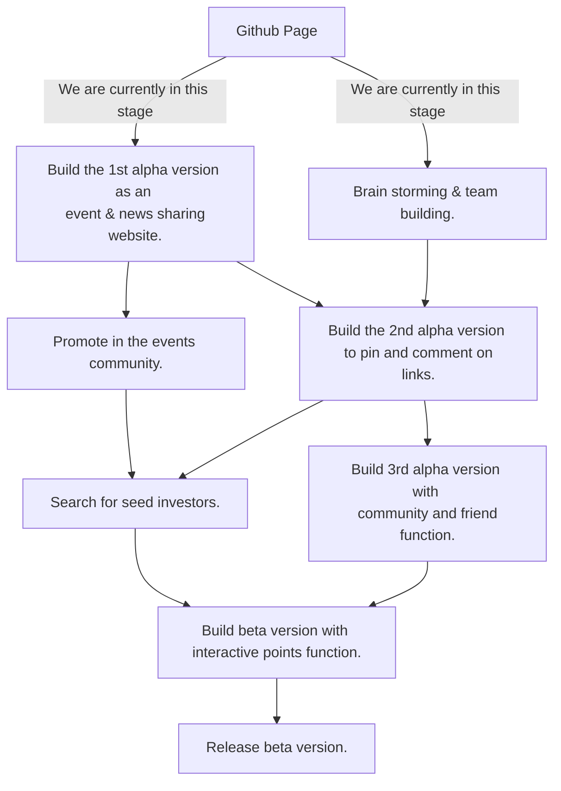

# Dig2Pin
<div align="center">

</div>


**Dig2Pin** is a social bookmarking platform to discover, pin, and comment interesting instant links in your friend circle.

> **Dig**
> Discover interesting instant links through your social network and system recommendation. Pin links you need to your pinboard.
>
> **Pin**
> Pin interesting links from "Dig Board" or URL, make it easy to find, and manage links you pinned on the pinboard. 
>
>**Unpin**
>If there are too many people downvote a link, we will remove the link from the platform.
>
> **Get Points** 
>You can get points by sharing good links or react with links pinned by others. You can use points for more advanced functions. Also, we will make a marketplace using points.

# Motivation
There are a bunch of links on the internet, some are instant and some are outdated or useless. We use the social network power to distinguish them.

# Road Map



# install through docker


1. Make sure you have docker and docker-compose

2. Create a project folder, put the file [docker-compose.yml](https://github.com/Dig2Pin/Dig2Pin/blob/master/docker-compose.yml) and [.env.example](https://github.com/Dig2Pin/Dig2Pin/blob/master/.env.example) in the folder

3. Change [.env.example](https://github.com/Dig2Pin/Dig2Pin/blob/master/.env.example) into .env.secret, Set your environment parameters in the .env.secret file

4. Inside the folder $ docker-compose up -d

5. Check http://localhost (You may not able to log in, you heed to have your own domain name and HTTPS. Check .env.example)


# build with us

### We'll use the CMS Node.js framework [keystone.js](https://github.com/keystonejs/keystone) to get start our project. 

```
1. Make sure you have Node.js >= 10.x by $ node --version

2. Make sure you have npm by $ npm --version

3. Make sure you have yarn by $ yarn --version

4. MongoDB >= 4.x; $ mongod (brew services start mongodb-community)

5. Open another window $ git clone https://github.com/Dig2Pin/Dig2Pin

6. $ cd Dig2Pin

7. $ npm install

8. Change the file ".env.example" into ".env", modify the parameters in the .env file.

9. $ yarn dev

10. check http://localhost:3000

```

files inside the site folder are copied from keystone blog example, need to modify.

# Join Us
We are a team from MeetUGo.Com platform,  which is a social calendar. We find out people have need to find more useful events in their social network. And we upgrade the idea to more formal links.

We are in the early stage. Contact us via huanry@mail.meetugo.com