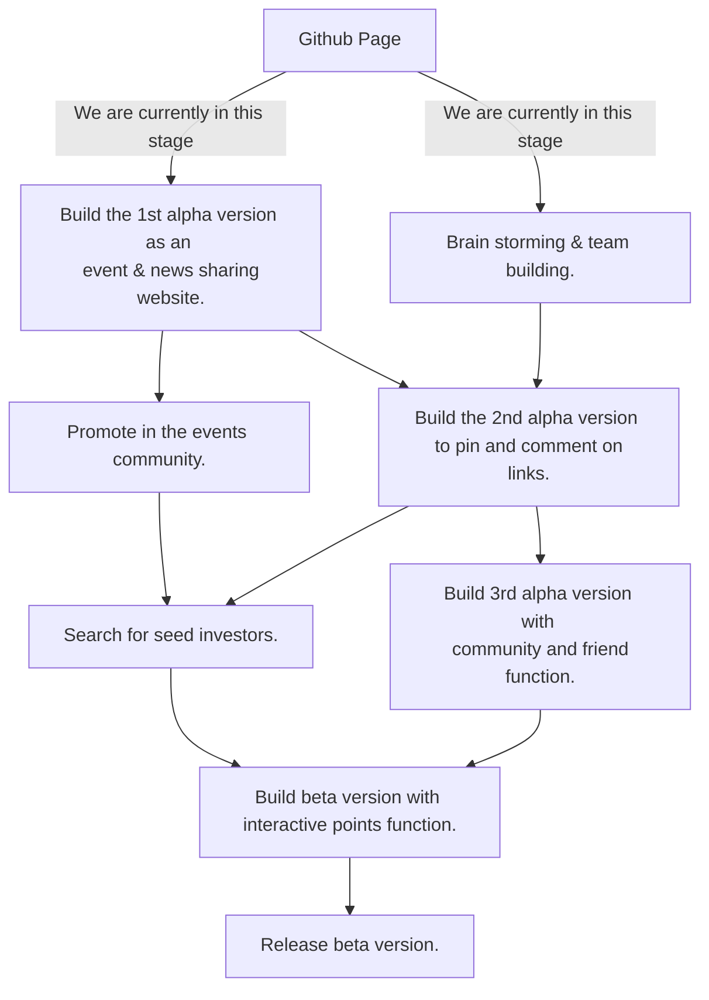

# Dig2Pin

**Dig2Pin** is a social bookmarking platform to discover, pin, and comment interesting instant links in your friend circle.

> **Dig**
> Discover interesting instant links through your social network and system recommendation. Pin links you need to your pinboard.
>
> **Pin**
> Pin interesting links from "Dig Board" or URL, make it easy to find, and manage links you pinned on the pinboard. 
>
>**Unpin**
>If there are too many people downvote a link, we will remove the link from the platform.
>
> **Get Points** 
>You can get points by sharing good links or react with links pinned by others. You can use points for more advanced functions. Also, we will make a marketplace using points.

# Motivation
There are a bunch of links on the internet, some are instant and some are outdated or useless. We use the social network power to distinguish them.

# Road Map

# How we build?
We'll use the CMS Node.js framwork [keystone.js](https://github.com/keystonejs/keystone) to get start our project. 

# About Us
We are team from MeetUGo.Com platform,  which is a social calendar. We find out people have need to find more useful events in their social network. And we upgrade the idea to more formal links.

We are in the early stage. Contact us via huanry@mail.meetugo.com